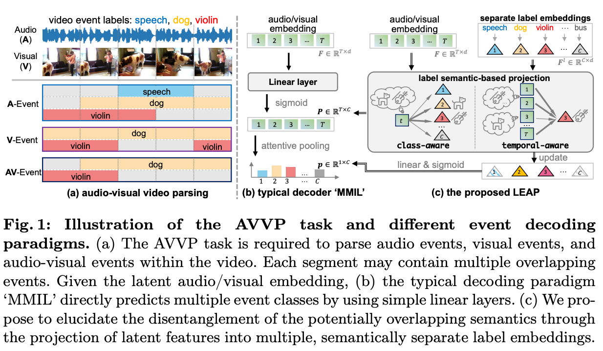

# Label-anticipated Event Disentanglement for Audio-Visual Video Parsing
Jinxing Zhou, Dan Guo, Yuxin Mao, Yiran Zhong, Xiaojun Chang, Meng Wang

Official code for ECCV 2024 paper: [Label-anticipated Event Disentanglement for Audio-Visual Video Parsing](https://www.ecva.net/papers/eccv_2024/papers_ECCV/papers/01492.pdf)

## Overview



## Data Preparation

1. **Features**  
  - The audio and visual features extracted by VGGish and ResNets can be downloaded from the repo of [Unified Multisensory Perception: Weakly-Supervised Audio-Visual Video Parsing](https://github.com/YapengTian/AVVP-ECCV20). Put the downloaded features into a created directory of ``../data/features``.
  - The label embeddings used in our LEAP method is extracted by pretrained Glove model. We have provided the label embeddings in ``./glove/6B/300d/llp_label_glove_embeddings.pt``. 
2. **Pseudo labels** 
   - The segment-level pseudo labels can be downloaded from the repo of [VALOR](https://github.com/Franklin905/VALOR). Put the downloaded pseudo labels into ``../data/CLIP`` and ``../data/CLAP`` respectively.


## Train the model


```script
bash run_leap_train.sh
```


## Test the model
The pre-trained model can be downloaded from this [Link](https://drive.google.com/file/d/1u2RtsCgS0iafyPB3RRO6h-hrG54_EzLO/view?usp=sharing)
```script
bash run_leap_test.sh
```
## Citation
```script
@inproceedings{zhou2025label,
  title={Label-anticipated event disentanglement for audio-visual video parsing},
  author={Zhou, Jinxing and Guo, Dan and Mao, Yuxin and Zhong, Yiran and Chang, Xiaojun and Wang, Meng},
  booktitle={European Conference on Computer Vision},
  pages={35--51},
  year={2025},
  organization={Springer}
}
```

## Acknowledgement
Thanks for the poineering work [AVVP](https://github.com/YapengTian/AVVP-ECCV20). The code of Encoder is based on [MM-Pyr](https://github.com/JustinYuu/MM_Pyramid). The pseudo labels are provided by [VALOR](https://github.com/Franklin905/VALOR). Thanks for their excellent work. The readers may consider our LEAP if you are using the typical MMIL decoder.
